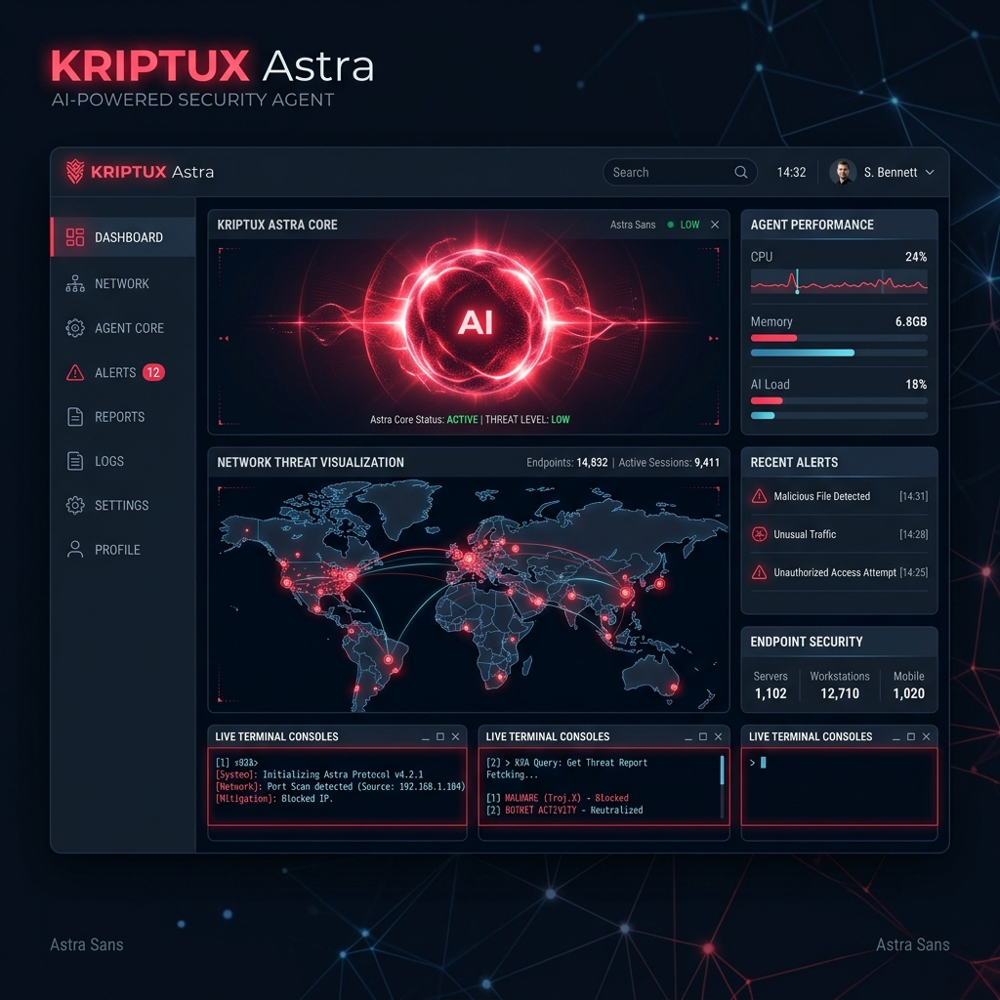
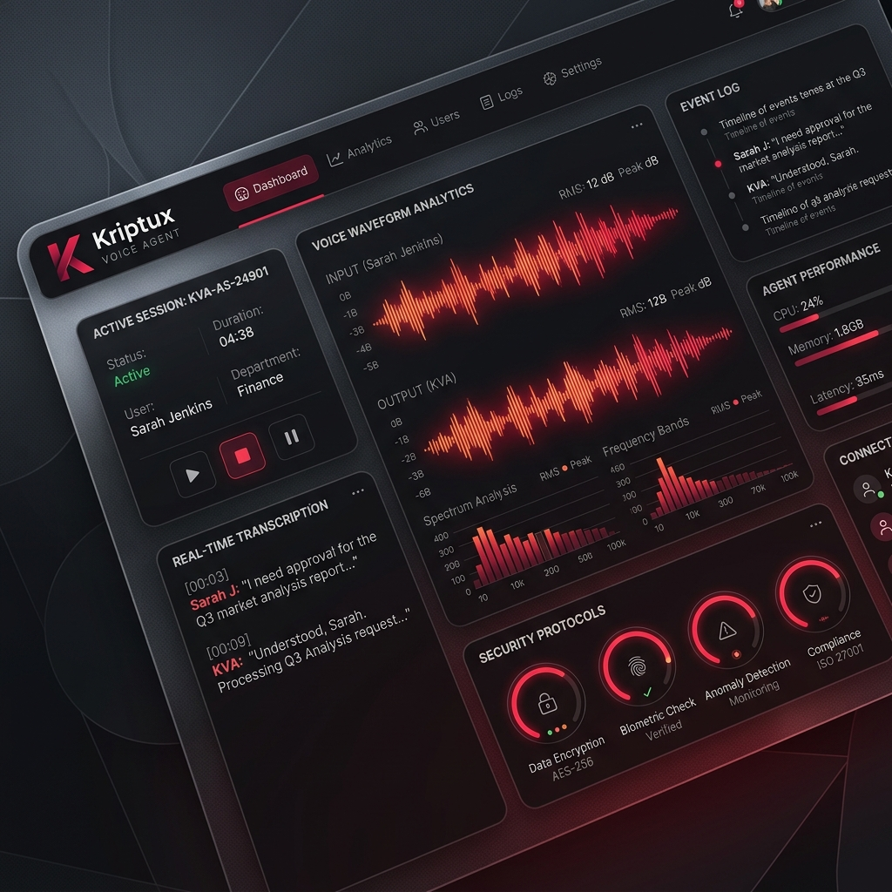

<!-- HEADER -->

<!-- TYPING -->

 

<!-- SOCIAL BADGES -->

&nbsp;

&nbsp;

&nbsp;

 

---

 
<table width="800px">
<tr>
<td style="background-color: #1a1a1a; border: 1px solid #333; border-radius: 8px; padding: 20px; font-family: 'Fira Code', monospace;">

● ● ●  
$ whoami --verbose 
[+] <b>NAME:</b> Akhil Manoj 
[+] <b>ROLE:</b> Security Researcher | AI Security Architect 
[+] <b>EXP:</b> Cyber Security Analyst @ Purple Nexus 
[+] <b>EDU:</b> BCA, Computer Science [A+] 
[+] <b>MISSION:</b> Architecting the next generation of autonomous security. 
$ status --check 
[SUCCESS] Systems Operational. Security Protocols Active.

</td>
</tr>
</table>

 

---

   
  
  
  
    
  

 

---

 
<table width="100%">
  <tr>
    <td align="center" width="33%">
       
      <b>Top 25% Researcher</b>
    </td>
    <td align="center" width="33%">
       
      <b>Practical Help Desk</b>
    </td>
    <td align="center" width="33%">
       
      <b>CEH v12 Certified</b>
    </td>
  </tr>
</table>

 

---

 

### 🤖 KRIPTUX Astra
*Autonomous Security Intelligence & Reconnaisance*
 

 
`Python` · `OpenAI` · `Advanced Recon`

 

### 🎙️ Kriptux Voice Agent
*Enterprise-Grade Secure AI Communication*
 

 
`LiveKit` · `Node.js` · `Real-time Security`

 

---

